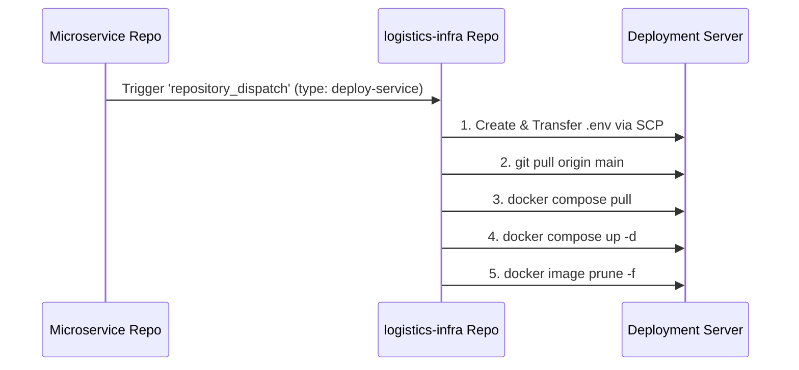

# 🚚 Sparta Logistics Infrastructure (`logistics-infra`)

스파르타 물류 시스템(Sparta Logistics System)의 전체 중앙 인프라 설계 및 마이크로서비스 컨테이너 오케스트레이션을 담당하는 중앙 인프라 저장소입니다.

Spring Cloud 기반의 **API Gateway**, **Eureka Service Discovery**, **Config Server** 등 전체 마이크로서비스 아키텍처의 핵심 인프라 서버 및 공통 서비스 컨테이너 환경을 직접 설계하고 구성했습니다.

---

## 🏛️ System Architecture

```
                                [ Client / External ]
                                          │
                                          ▼
                         ┌─────────────────────────────────┐
                         │   Spring Cloud Gateway (:8080)  │
                         └─────────────────────────────────┘
                                          │
                  ┌───────────────────────┴───────────────────────┐
                  ▼                                               ▼
     ┌────────────────────────┐                      ┌────────────────────────┐
     │  Eureka Discovery      │                      │  Spring Config Server  │
     │  Server (:8761)        │                      │  (:18081)              │
     └────────────────────────┘                      └────────────────────────┘
                  │                                               │
  ┌───────────────┼───────────────┬───────────────┬───────────────┼───────────────┐
  ▼               ▼               ▼               ▼               ▼               ▼
┌───────────┐   ┌───────────┐   ┌───────────┐   ┌───────────┐   ┌───────────┐   ┌───────────┐
│ Auth      │   │ User      │   │ Hub       │   │ Company & │   │ Order     │   │ Delivery  │ ...
│ Service   │   │ Service   │   │ Service   │   │ Product   │   │ Service   │   │ Service   │
└─────┬─────┘   └─────┬─────┘   └─────┬─────┘   └─────┬─────┘   └─────┬─────┘   └─────┬─────┘
      │               │               │               │               │               │
  [Auth DB]       [User DB]       [Hub DB]      [Company DB]     [Order DB]     [Delivery DB]

  ┌───────────────────────────────────────────────────────────────────────────────────────┐
  │ Shared Infrastructure: PostgreSQL | Redis (:6379) | RabbitMQ (:5672) | Zipkin (:9411) │
  └───────────────────────────────────────────────────────────────────────────────────────┘
```

---

## 🛠 주요 구성 요소 및 기술 스택

- **Orchestration**: Docker, Docker Compose (v2.20+ `include` 디렉티브 표준 지원)
- **CI/CD Pipeline**: GitHub Actions (`repository_dispatch` 기반 이벤트 배포)
- **Core Infra Services**:
  - **API Gateway**: Spring Cloud Gateway (라우팅, 인가 처리, 진입점)
  - **Service Discovery**: Spring Cloud Eureka Server (동적 서비스 등록 및 헬스 체크)
  - **Config Management**: Spring Cloud Config Server (중앙화 Git 기반 설정 관리)
  - **Message Broker & Cache**: RabbitMQ (비동기 이벤트 발행/구독), Redis (캐싱 및 세션/토큰 관리)
  - **Distributed Tracing**: OpenZipkin (마이크로서비스간 요청 분산 트레이싱)
  - **Database**: PostgreSQL 15 (각 마이크로서비스별 Database Per Service 패턴 적용)

---

## 🏗️ Docker Compose 모듈화 구조

단일 파일 관리의 복잡성을 해결하고 각 서비스팀의 독립성을 보장하기 위해 Docker Compose `include` 기능을 활용하여 파일 구조를 모듈화했습니다.

```yaml
# docker-compose.yml
include:
  - docker-compose.infra.yml           # PostgreSQL, Redis, RabbitMQ, Zipkin 등 공통 인프라
  - docker-compose.config.yml          # Spring Cloud Config Server
  - docker-compose.discovery.yml       # Eureka Service Discovery
  - docker-compose.gateway.yml         # Spring Cloud Gateway
  - docker-compose.notification.yml    # Notification Service & DB
  - docker-compose.hub.yml             # Hub Service & DB
  - docker-compose.user.yml            # User Service & DB
  - docker-compose.auth.yml            # Auth Service & DB
  - docker-compose.delivery.yml        # Delivery Service & DB
  - docker-compose.company-product.yml # Company & Product Service & DB
  - docker-compose.order.yml           # Order Service & DB
```

### 📂 서비스 모듈 상세 설명

| 모듈 파일 | 컨테이너명 | 주요 역할 및 연동 스택 |
| :--- | :--- | :--- |
| **`docker-compose.infra.yml`** | `logistics-rabbitmq`<br>`logistics-redis`<br>`logistics-zipkin-server` | 공통 메시지 큐(RabbitMQ 3.x), 캐시(Redis 7.x), 분산 트레이싱(Zipkin) 제공 |
| **`docker-compose.discovery.yml`** | `logistics-discovery-server` | Spring Cloud Eureka 기반 서비스 등록 및 검색 (`Actuator Healthcheck` 포함) |
| **`docker-compose.config.yml`** | `logistics-config-server` | 외부 Git 저장소 연동 중앙 설정 서버 (Discovery 서버 의존) |
| **`docker-compose.gateway.yml`** | `logistics-gateway-server` | 라우터 및 API 단일 진입점 서버 |
| **`docker-compose.auth.yml`** | `logistics-auth-db`<br>`logistics-auth-service` | 사용자 인증/인가, JWT 발급 및 검증 |
| **`docker-compose.user.yml`** | `logistics-user-db`<br>`logistics-user-service` | 사용자 프로필, 권한 및 계정 관리 |
| **`docker-compose.hub.yml`** | `logistics-hub-db`<br>`logistics-hub-service` | 허브 경로 및 경로 최적화 (Naver Map API 연동) |
| **`docker-compose.company-product.yml`** | `logistics-company-product-db`<br>`logistics-company-product-service` | 업체 정보 및 상품 재고/등록 관리 |
| **`docker-compose.order.yml`** | `logistics-order-db`<br>`logistics-order-service` | 주문 생성, 상태 관리 및 트랜잭션 처리 |
| **`docker-compose.delivery.yml`** | `logistics-delivery-db`<br>`logistics-delivery-service` | 배송 담당자 할당, 배송 경로 및 상태 추적 |
| **`docker-compose.notification.yml`** | `logistics-notification-db`<br>`logistics-notification-service` | Slack API 및 OpenAI 연동 알림 메세지 생성 및 발송 |

---

## ⚙️ CI/CD 자동 배포 파이프라인

개별 마이크로서비스 리포지토리에서 빌드/테스트 성공 후 `repository_dispatch` 이벤트를 본 저장소로 전송하면, 중앙 배포 파이프라인이 자동 실행되어 배포 서버 환경을 최신 상태로 유지합니다.



### 📄 GitHub Actions 워크플로우 예시 (`.github/workflows/deploy.yml`)

```yaml
name: Deploy on Dispatch

on:
  repository_dispatch:
    types: [ deploy-service ]

jobs:
  deploy-on-dispatch:
    runs-on: ubuntu-latest

    steps:
      - name: Checkout Repository
        uses: actions/checkout@v4

      - name: Create .env file
        run: |
          echo "${{ secrets.ENV_FILE }}" > .env

      - name: Copy .env to Server via SCP
        uses: appleboy/scp-action@v0.1.7
        with:
          host: ${{ secrets.SERVER_HOST }}
          username: ${{ secrets.SERVER_USERNAME }}
          key: ${{ secrets.SSH_PRIVATE_KEY }}
          source: ".env"
          target: ${{ secrets.WORD_DIRECTORY }}

      - name: Deploy to Server via SSH
        uses: appleboy/ssh-action@v1.0.3
        with:
          host: ${{ secrets.SERVER_HOST }}
          username: ${{ secrets.SERVER_USERNAME }}
          key: ${{ secrets.SSH_PRIVATE_KEY }}
          script: |
            cd ${{ secrets.WORD_DIRECTORY }}
            git pull origin main
            sudo docker compose pull
            sudo docker compose up -d
            sudo docker image prune -f
```

---

## 🚀 로컬 및 인프라 구동 가이드

### 1. 사전 요구사항
- Docker Engine 24.0+ 및 Docker Compose v2.20+ (`include` 디렉티브 지원)
- 공통 Docker 네트워크 사전 생성 (`logistics-network`)

```bash
# Docker 외부 네트워크 생성 (미존재 시)
docker network create logistics-network
```

### 2. 환경변수 설정 (`.env`)
프로젝트 루트 경로에 `.env` 파일을 작성해야 합니다.

### 3. 컨테이너 실행 및 명령어

```bash
# 전체 마이크로서비스 및 인프라 통합 구동
docker compose up -d

# 실행 상태 전체 확인
docker compose ps

# 전체 로그 실시간 확인
docker compose logs -f

# 특정 마이크로서비스 모듈만 단독 구동 (예: 공통 인프라만 구동)
docker compose -f docker-compose.infra.yml up -d

# 전체 컨테이너 중지 및 삭제
docker compose down
```

---

## 🔍 주요 웹 콘솔 및 대시보드

| 서비스 명 | URL / 주소 | 비고 |
| :--- | :--- | :--- |
| **API Gateway** | `http://localhost:8080` | 전체 서비스 엔드포인트 진입점 |
| **Eureka Discovery Dashboard** | `http://localhost:8761` | 서비스 등록 현황 및 Health 상태 확인 |
| **Zipkin Tracing UI** | `http://localhost:9411` | 분산 트레이싱 및 요청 딜레이 분석 |
| **RabbitMQ Management** | `http://localhost:15672` | 큐/익스체인지 및 메시지 모니터링 |
| **Config Server Actuator** | `http://localhost:18081/actuator/health` | Config Server 헬스체크 |
