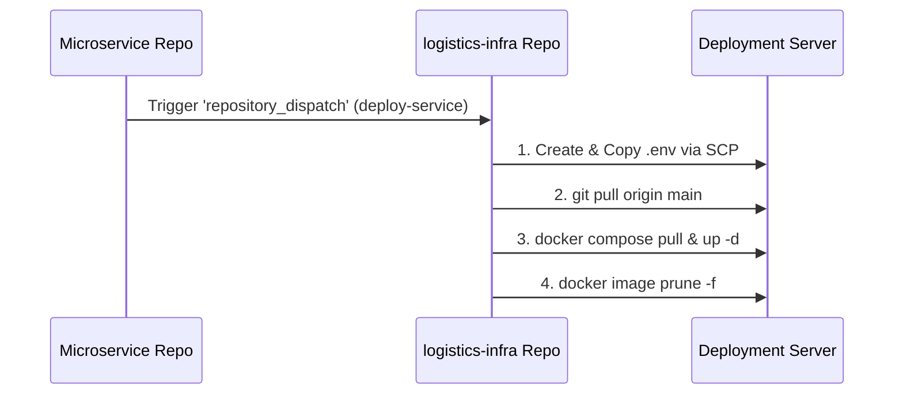

# 🚚 Sparta Logistics Infrastructure (`logistics-infra`)

스파르타 물류 시스템(Sparta Logistics System)의 전체 중앙 인프라 및 마이크로서비스 컨테이너 오케스트레이션을 담당하는 중앙 인프라 저장소입니다.

---

## 🛠 주요 구성 요소 및 기술 스택

- **Orchestration**: Docker, Docker Compose (v2.20+ `include` 지원)
- **CI/CD Pipeline**: GitHub Actions (`repository_dispatch` 기반 이벤트 배포)
- **Service Discovery & Config**: Spring Cloud Eureka Server, Spring Cloud Config Server
- **API Gateway**: Spring Cloud Gateway
- **Infra Services**: PostgreSQL, Redis, RabbitMQ, Zipkin

---

## 🏗️ Docker Compose 모듈화 구조

단일 대형 파일의 복잡성을 줄이고 서비스별 독립성을 유지하기 위해 Docker Compose의 `include` 구문을 활용하여 모듈화되어 있습니다.

```yaml
# docker-compose.yml
include:
  - docker-compose.infra.yml       # PostgreSQL, Redis, RabbitMQ, Zipkin 등 공통 인프라
  - docker-compose.config.yml      # Spring Cloud Config Server
  - docker-compose.discovery.yml   # Eureka Service Discovery
  - docker-compose.gateway.yml     # Spring Cloud Gateway
  - docker-compose.notification.yml # Logistics Notification Service
```

### 📂 모듈별 역할
- **`docker-compose.infra.yml`**: 데이터베이스, 메시지 브로커, 캐시, 분산 트레이싱 등 핵심 공통 인프라
- **`docker-compose.config.yml`**: 각 마이크로서비스의 중앙화된 설정 관리 서버
- **`docker-compose.discovery.yml`**: 마이크로서비스 동적 위치 라우팅을 위한 Eureka Server
- **`docker-compose.gateway.yml`**: 외부 요청 진입점 및 라우팅/인증 처리 Gateway
- **`docker-compose.notification.yml`**: 알림 마이크로서비스 컨테이너 구성

---

## ⚙️ CI/CD 자동 배포 파이프라인

각 마이크로서비스 리포지토리(예: `notification-service`)에서 CI 완료 후 `repository_dispatch` 이벤트를 발생시키면, 본 저장소의 워크플로우가 동작하여 배포 서버의 환경을 최신화합니다.



### 📄 GitHub Actions 워크플로우 (`.github/workflows/deploy.yml`)

```yaml
name: Deploy on Dispatch

on:
  repository_dispatch:
    types: [ deploy-service ]

jobs:
  deploy-on-dispatch:
    runs-on: ubuntu-latest

    steps:
      - name: Checkout Repository
        uses: actions/checkout@v4

      # .env 파일 생성
      - name: Create .env file
        run: |
          echo "${{ secrets.ENV_FILE }}" > .env

      # scp를 이용해 .env 파일을 원격 서버로 전송
      - name: Copy .env to Server via SCP
        uses: appleboy/scp-action@v0.1.7
        with:
          host: ${{ secrets.SERVER_HOST }}
          username: ${{ secrets.SERVER_USERNAME }}
          key: ${{ secrets.SSH_PRIVATE_KEY }}
          source: ".env"
          target: ${{ secrets.WORD_DIRECTORY }}

      # SSH 접속 후 pull 및 빌드/실행
      - name: Deploy to Server via SSH
        uses: appleboy/ssh-action@v1.0.3
        with:
          host: ${{ secrets.SERVER_HOST }}
          username: ${{ secrets.SERVER_USERNAME }}
          key: ${{ secrets.SSH_PRIVATE_KEY }}
          script: |
            cd ${{ secrets.WORD_DIRECTORY }}
            
            git pull origin main
            
            sudo docker compose pull
            sudo docker compose up -d
            
            sudo docker image prune -f
```

---

## 🚀 로컬 및 인프라 구동 가이드

### 1. 사전 요구사항
- Docker 24.0+ / Docker Compose v2.20+ (`include` 디렉티브 지원 필수)

### 2. 환경변수 설정
프로젝트 최상단에 `.env` 파일을 작성합니다.
```env
# Database Settings
POSTGRES_DB=logistics
POSTGRES_USER=postgres
POSTGRES_PASSWORD=your_password

# RabbitMQ / Redis
RABBITMQ_DEFAULT_USER=guest
RABBITMQ_DEFAULT_PASS=guest

# Infra Service Ports
CONFIG_SERVER_PORT=8888
EUREKA_SERVER_PORT=8761
GATEWAY_PORT=8080
```

### 3. 전체 인프라 및 서비스 실행
```bash
# 전체 컨테이너 백그라운드 실행
docker compose up -d

# 전체 상태 확인
docker compose ps

# 로그 확인
docker compose logs -f
```

### 4. 특정 모듈만 구동하고 싶은 경우
```bash
# 공통 데이터베이스/인프라만 구동
docker compose -f docker-compose.infra.yml up -d
```